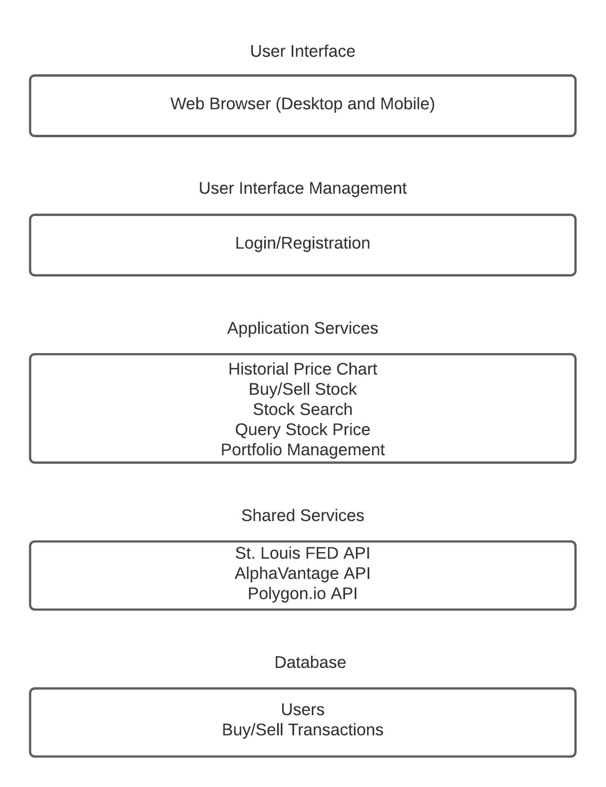
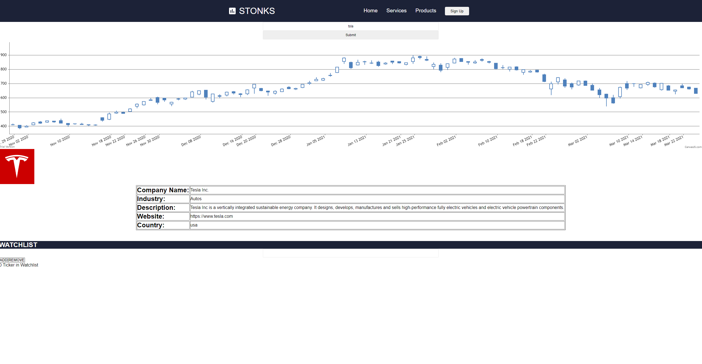

# STONKS Containerization

## Product Vision

FOR students WHO want to learn more about investing, THE STONKS is an educational/financial web
application THAT is tailored to students with little money or knowledge of the stock market. UNLIKE Robinhood and other trading brokerages, OUR product provides the foundational knowledge on how to start investing in the stock market.

## Summary

We extended our prototype with dynamic stock search, historical price chart, and watchlist. We implemented a search bar (calls polygon API), a stock information display (polygon API), historical price chart (AlphaVantage API), and a basic watchlist with limited functionality.

# Docker

Prerequisites: [Docker Desktop](https://www.docker.com/products/docker-desktop)

## Steps to use Docker container

1. Download image from Docker Hub

`docker pull bermetkydyk/stonks`

2. Rename local Docker image

`docker tag bermetkydyk/stonks stonks-image`

3. Run docker image

`docker run --name stonks-container -dp 3000:3000 stonks-image`

4. Open [localhost:3000](http://localhost:3000)
5. Search for your favorite stock

# Product Architecture

## Important Qualities

- Nonfunctional Product Characteristics

  - Security

    - Only account owner is able to access individual portfolio information

  - Performance
    - Being able to make reliable and consistent trades at the current quoted price no matter how many concurrent users

* Product Lifetime
  - Regular updates would extend trading functionality beyond typical financial instruments. Cryptocurrency may be an viable avenue to explore.

## Layered Architecture

## Technologies

- Database - NoSQL
- Platform - Web Application
- Server - Netlify
- Development Technologies - React (Web Platform), Express/Node, Firebase

# Instructions

Prerequisites: Node.js and npm

1. `git clone https://github.com/CSCI-40500-77100-Spring-2021/project-7.git`
2. `cd project-7`
3. `npm install` - Install app dependencies
4. `npm start` - Run the app in the development mode.
5. After you install everything go to localhost:3000 and enter stock ticker

   
